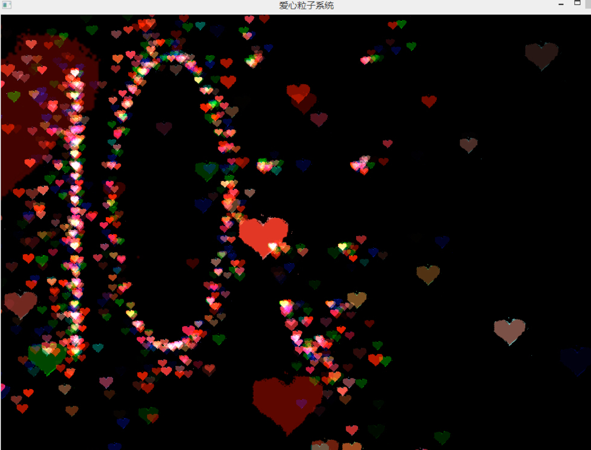
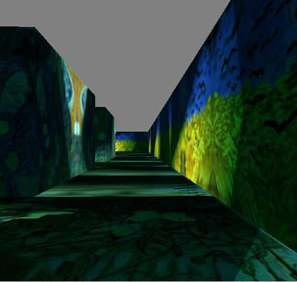
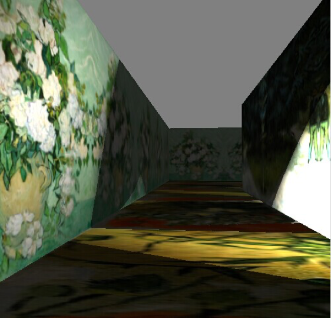

# GoghMaze

## 3D GoghMaze Roaming based on GPU and OpenGL Shading
This project includes several hello-world codes for computer graphic techniques, such as the world coordinate, camera roaming, texture mapping, lighting and shadows. It is implemented using GLSL, which sends the vertex data to the GPU for computing and adds light models to the maze world. Besides, we map the works of Vincent Willem van Gogh to the maze walls.

## Notice
It is built four years ago, and therefore some functions may be deprecated.

## Technical Slide
You can see the technical details from slides: CG_3D_Maze_Roaming.pdf and CG_Texture_and_Light.pdf

We also provide an implementation for "LOVE" particle system, see CG_Particle_System.pdf

## Demo

